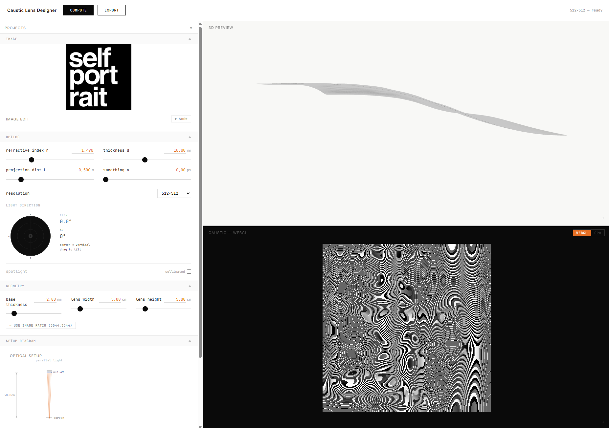
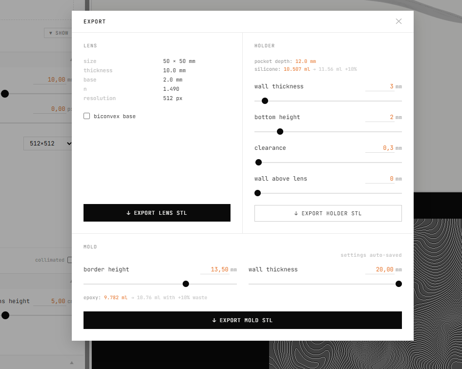
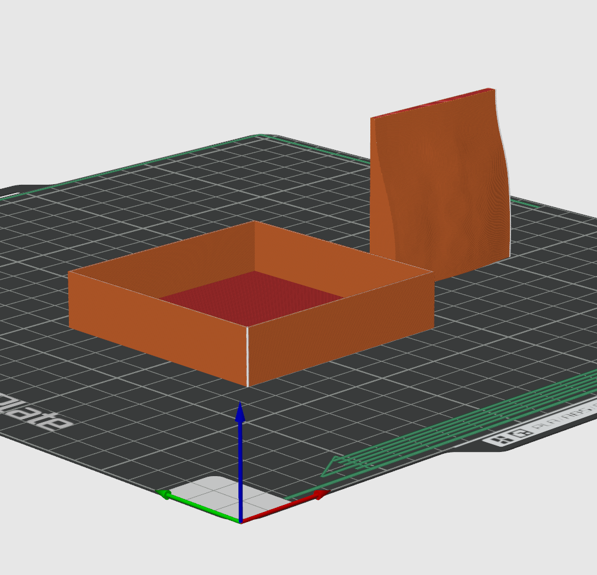

# Spatial Caustics

Inverse caustic lens designer: upload a target image → compute a refractive height field → preview real-time caustics in-browser → export printable STL for lens and mold.







## What it does

Given a target grayscale image, the solver computes a lens surface (height field) such that collimated light refracted through it produces that image as a caustic pattern on a wall at a configurable projection distance. The lens can be 3D-printed in clear resin and filled with UV-curing epoxy.

## Features

- **Inverse solver** — Monge-Ampère / Schwartzburg 2014 iterative method
- **Real-time WebGL caustic preview** — Evans Wallace triangle scatter (physically correct brightness)
- **CPU caustic simulation** — forward ray splatting for ground-truth reference
- **3D lens viewer** — Three.js with height exaggeration
- **Scene viewer** — full lamp → lens → wall view with sample refraction rays
- **STL export** — watertight lens + mold (with configurable wall thickness, border, base height)
- **Epoxy volume estimate** — shown at export time, included in filename
- **Project save/load** — named projects persisted on backend

## Setup

### Backend

```bash
cd backend
python -m venv .venv
# Windows:
.venv\Scripts\activate
# macOS/Linux:
source .venv/bin/activate

pip install -r requirements.txt
uvicorn main:app --reload --port 8000
```

### Frontend

```bash
cd frontend
npm install
npm run dev
```

Open http://localhost:5173

## Architecture

```
backend/
  main.py         FastAPI routes (compute, export STL, project CRUD)
  solver.py       Monge-Ampère iterative solver (Schwartzburg 2014)
  simulation.py   CPU forward caustic simulation (ray splatting)
  stl_export.py   Watertight STL from height field (lens + mold)
  projects.py     Project persistence (JSON)

frontend/src/
  components/     React UI
    ControlBar      Compute trigger + export modal
    ParamPanel      Optics / geometry / solver params
    CausticPreview  WebGL RT + CPU sim toggle
    SceneViewer     Three.js scene (lamp / lens / wall / rays)
    ThreeViewer     Isolated lens 3D preview
    ExportPanel     STL export with mold settings + epoxy volume
    SetupDiagram    Annotated cross-section SVG
  hooks/
    useWebGLCausticRT   Evans Wallace triangle caustic (WebGL)
    useThreeViewer      Three.js lens mesh
  stores/
    lensStore       Zustand — params, compute result, dirty flag
```

## About

Spatial Caustics basiert auf der Methode von Schwartzburg et al. (2014, ETH Zürich). Gegeben ein Zielbild berechnet ein iterativer Solver (Monge-Ampère) das Höhenprofil einer Linse so, dass kollimiertes Licht durch Refraktion exakt dieses Bild als Caustic auf eine Wand projiziert. Die Linse kann als STL exportiert, gedruckt oder gegossen werden.

> Schwartzburg, Y., Testuz, R., Tagliasacchi, A., Pauly, M. (2014). *Computational Caustic Design.* ACM Transactions on Graphics, 33(4). ETH Zürich.

## Physics

**Forward model**

- Surface normal: `N = normalize(−∂h/∂x, −∂h/∂y, 1)`
- Refraction: Snell's law via GLSL `refract()`
- Wall hit: `p_wall = p_lens + t · R`, where `t = (−L − h) / R.z`

**Inverse solver**

- Transport map: `Φ(x) = x + L · (n−1) · ∇h`
- Jacobian constraint: `det(dΦ/dx) = I_target(Φ(x)) / I_uniform`
- Solved as iterative Poisson problem on height-field Laplacian

**WebGL caustic (Evans Wallace method)**

Each lens quad becomes two triangles on the wall after refraction. Additive blending accumulates light: focused regions → smaller triangles → same per-fragment intensity → higher overlap per pixel → physically correct brightness concentration.
